```{r setup, include=FALSE}
# For htmltools package, you may set options(htmltools.dir.version = FALSE) to suppress the version number in the subdirectory name.
options(htmltools.dir.version = FALSE)
knitr::opts_chunk$set(echo = TRUE)
knitr::opts_chunk$set(message = FALSE)
knitr::opts_chunk$set(warning = FALSE)
options(knitr.duplicate.label = "allow")

knitr::opts_chunk$set(fig.width = 6, message = FALSE, warning = FALSE, comment = "", cache = F)

library(emo)
library(fontawesome)
library(knitr)
library(dplyr)
library(flair)
library(flipbookr)
library(tidyverse)

library(xaringanExtra)
xaringanExtra::use_panelset()
xaringanExtra::use_tile_view()
```

background-size: 80%
background-image: url(melindabio.png)
background-position: 70% 70%
class: center, top

---

# Overview

This workshop will cover:

* An introduction to R and RStudio
* Learning about R Objects and data structures
* Getting data into and out of R
* Data Wrangling
* Data Visualization _(e.g. `ggplot2`)_
* Basic statistical analyses and models
* Brief intro to simple choropleth maps
* Brief Intro to RMarkdown
* _[time permitting] _
    - _data joins and restructuring_
    - _introduction to linear and logistic regression_
    - _other topics as requested by attendees_

---

# DAY 1 SCHEDULE

`r fontawesome::fa(name = "calendar")`: April 21, 2022  
`r emo::clock(as.POSIXct("2022-04-21 09:00:00 EDT"))`: 09:00 - 17:30

## Schedule

| Time          | Activity         |
| :------------ | :--------------- |
| 09:00 - 10:15 | Module 1         |
| 10:15 - 10:30 | _Break_          |
| 10:30 - 12:00 | Module 2         |
| 12:00 - 13:00 | **LUNCH**        |
| 13:00 - 14:15 | Module 3         |
| 14:15 - 14:25 | _Break_          |
| 14:25 - 15:30 | Module 4         |
| 15:30 - 15:40 | _Break_          |
| 15:40 - 17:00 | Module 5         |
| 17:00 - 17:30 | _Post workshop Q&A; one-on-one help_ |

---

# A few quick poll questions:

[1] Do you have any experience with R? [pick 1 response]

* Go to [https://PollEv.com/multiple_choice_polls/KOKqJrxm4BcuTeTVbWYgh/respond](https://PollEv.com/multiple_choice_polls/KOKqJrxm4BcuTeTVbWYgh/respond)

---

# A few quick poll questions:

[2] What do you want to learn during this R Workshop? [free text, can enter multiple responses]

* Go to [https://PollEv.com/free_text_polls/sNkrLYKXk5HEFEampZSGp/respond](https://PollEv.com/free_text_polls/sNkrLYKXk5HEFEampZSGp/respond)

---

# A few quick poll questions:

[3] What intimidates you about learning R? [free text, can enter multiple responses]

* Go to [https://PollEv.com/free_text_polls/6upJRZaEzcRhYmIGjNwRL/respond](https://PollEv.com/free_text_polls/6upJRZaEzcRhYmIGjNwRL/respond)

---

# R + RStudio

.pull-left[
### Plain R Console

Old Fashioned "command line"

```{r out.width = '=100%', echo=FALSE}
knitr::include_graphics("Rconsole.png")
```
]

.pull-right[
### RStudio IDE

Integrated Development Environment

```{r out.width = '=100%', echo=FALSE}
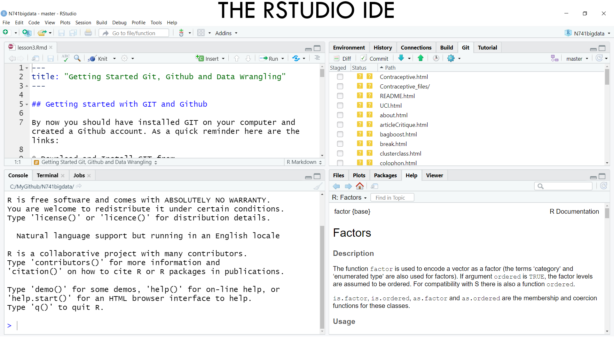
```

_NOTE: This is NOT a GUI_
]

---

background-size: 100%
background-image: url(rstudio_ide01.png)
background-position: 70% 70%
class: center, top

---

background-size: 100%
background-image: url(rstudio_ide02.png)
background-position: 70% 70%
class: center, top

---

background-size: 100%
background-image: url(rstudio_ide03.png)
background-position: 70% 70%
class: center, top

---

background-size: 100%
background-image: url(rstudio_ide04.png)
background-position: 70% 70%
class: center, top

---

background-size: 100%
background-image: url(rstudio_ide05.png)
background-position: 70% 70%
class: center, top

---

background-size: 100%
background-image: url(rstudio_ide06.png)
background-position: 70% 70%
class: center, top

---

class: inverse, middle, left

# Let's get started!!
### 1. Open RStudio

---

# Create a new project
Go to File/New Project

```{r out.width = '=100%', echo=FALSE}
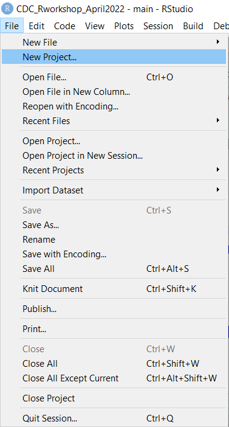
```

---

# Create a new project
Choose New Directory

```{r out.width = '=100%', echo=FALSE}
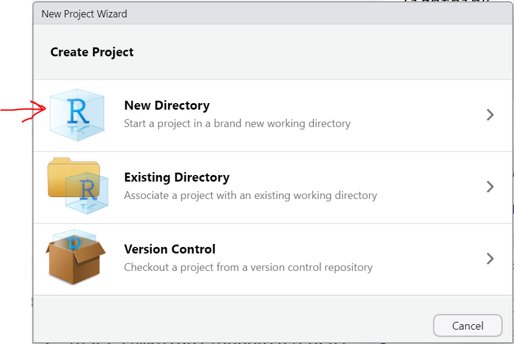
```

---

# Create a new project
Click New Project

```{r out.width = '=100%', echo=FALSE}
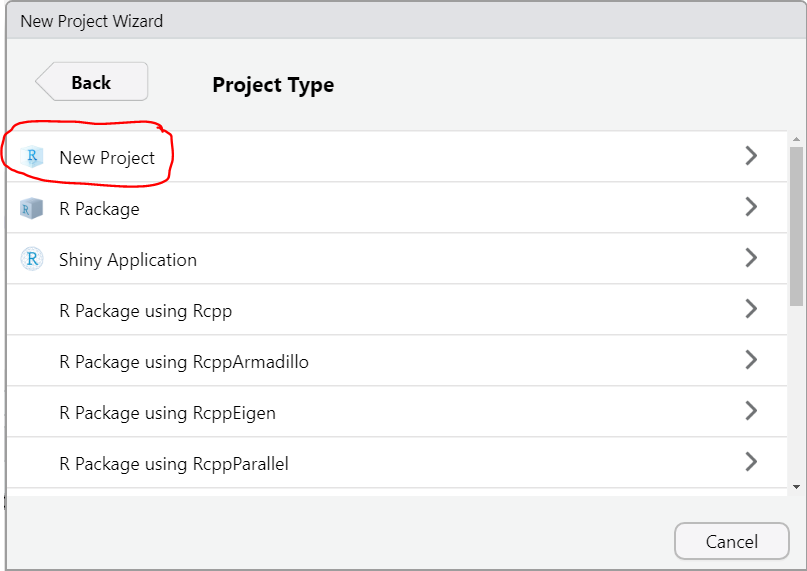
```

---

# Create a new project
Type in folder name and choose parent directory

```{r out.width = '=100%', echo=FALSE}
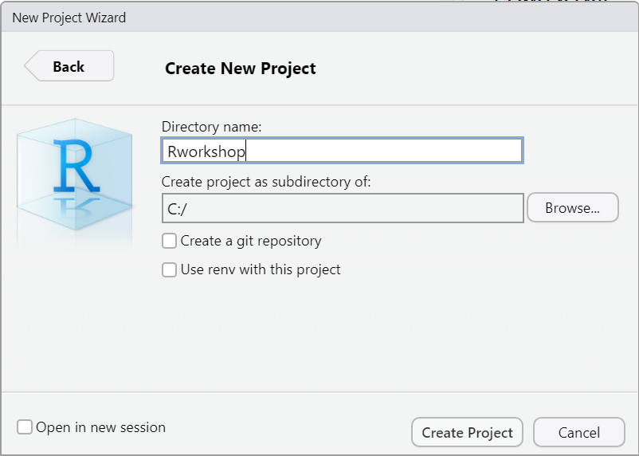
```

---

# What is a RStudio "Project"?

* A "container" or _aka_ a directory with all files for this RStudio Project

--


* Good Coding Practice!!

--


* The DEFAULT place RStudio looks for your files

---

# Your new `Rworkshop` project


```{r out.width = '=80%', echo=FALSE}
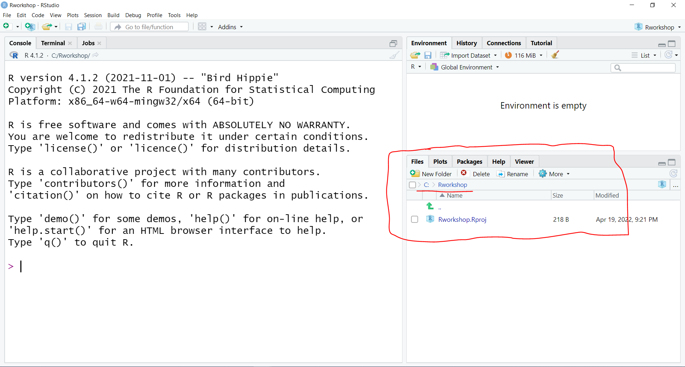
```

---

# Get files for the Workshop

1. Go to https://melindahiggins2000.github.io/CDC_Rworkshop_April2022/

2. Download `module01_Rscript.R` and put it into the new folder on your computer, _e.g._ `C:\Rworkshop`.

```{r out.width = '=80%', echo=FALSE}
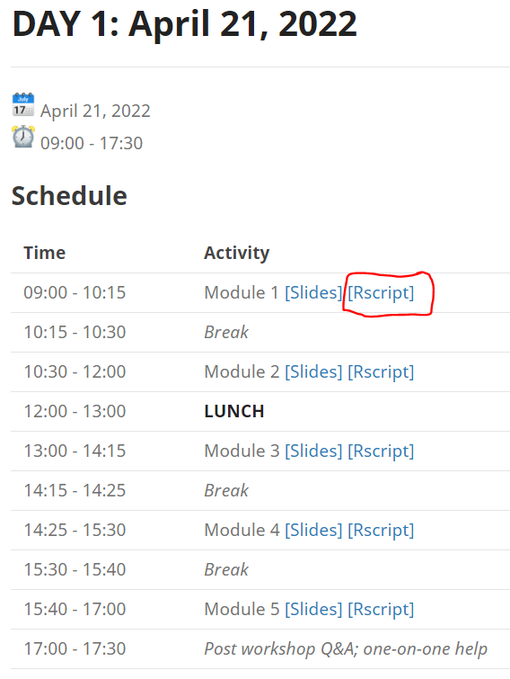
```

---

# Files in your `Rworkshop` folder on your computer


```{r out.width = '=80%', echo=FALSE}
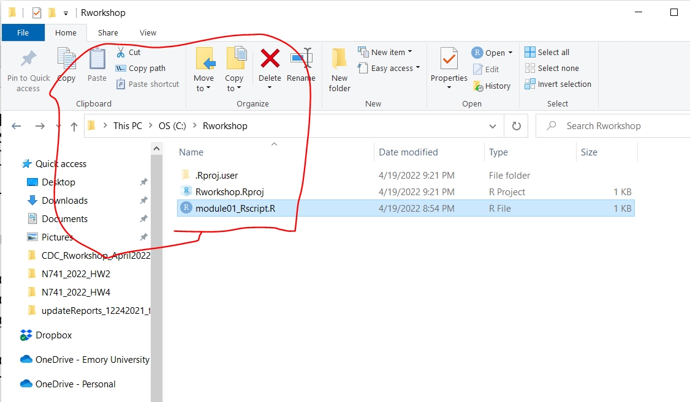
```
---

# Files in your `Rworkshop` folder/RStudio project

```{r out.width = '=80%', echo=FALSE}
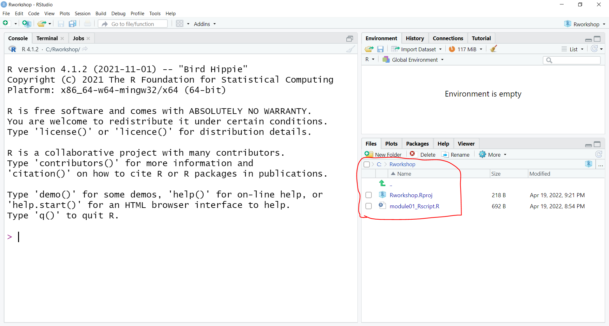
```

.footnote[Click on `module01_Rscript.R` to open it.]

---

```{r out.width = '=100%', echo=FALSE}
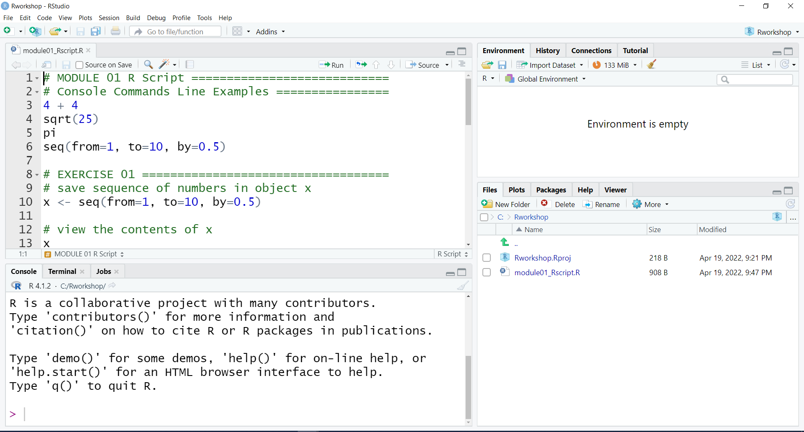
```

.footnote[Type code at command line or run one line at a time from script window.]
---

# Basic commands done in Console

```{r out.width = '=80%', echo=FALSE}
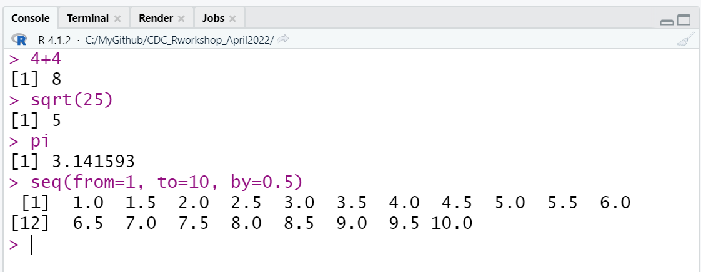
```

---

```{r console1, include = FALSE}
4 + 4
sqrt(25)
pi
seq(from=1, to=10, by=0.5)
```

`r chunk_reveal(chunk_name = "console1", title = "Code lines run in the console or from script window")`

---

# **ASSIGN** your results to an "object", use .big[**<-**] 

.pull-left[

We really don't want to keep typing one line at a time in the Console, so we need to save/store value(s) in an object. An object is a text string we use to retrieve the value (or elements) we saved. Let's save the results of `2+2` in an object `result`.

For this we will use the **ASSIGN** operator .big[**`<-`**].

```{r}
result <- 2+2
```
]

--

.pull-right[

This is saved now in your "Global Environment". To retrieve this value, simply type the text string `result` to see the value `4`.

```{r}
result
```

]

--

.pull-right[

]

---

class: inverse, middle, left

# Your Turn

### 1. Start RStudio - Open "module01_Rscript.R"
### 2. Highlight Run Code for EXERCISE 01

---

# How to "run" code in an R script

```{r out.width = '=80%', echo=FALSE}
knitr::include_graphics("module01_runExample01.png")
```
---

```{r console2, include = FALSE}
# save sequence of numbers in object x
x <- seq(from=1, to=10, by=0.5)

# view the contents of x
x

# use x to create new object y
y <- x*x

# plot x and y
plot(x,y)
```

`r chunk_reveal(chunk_name = "console2", title = "Create Objects and Use Them")`

---

# Questions

.pull-left[

1. How many objects are in your "Environment" [top right window]

2. What kind of object is `x`?

3. How many elements does `y` have in it?

4. Where do you see the plot?

]

.pull-right[
```{r out.width = '=100%', echo=FALSE}
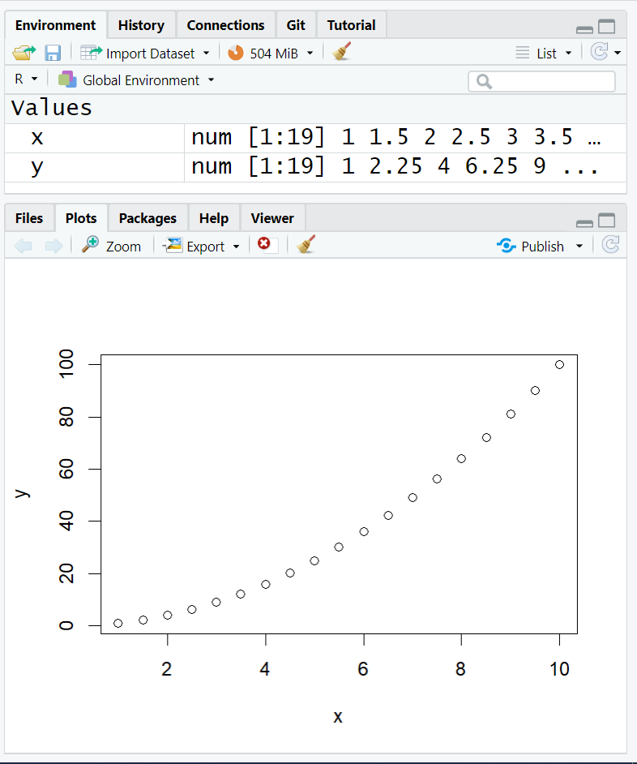
```
]

---

# Questions

.pull-left[

### Getting Help

To find out what the `seq()` function does, in the Console window [bottom left] at the prompt `>` type:

.left[`help(seq)`]

```{r}
seq(from=1, to=10, by=0.5)
```

Notice that we used equals `=` inside the `()` to assign _values_ to the _arguments_ for the `seq()` function.

]

.pull-right[
```{r out.width = '=100%', echo=FALSE}
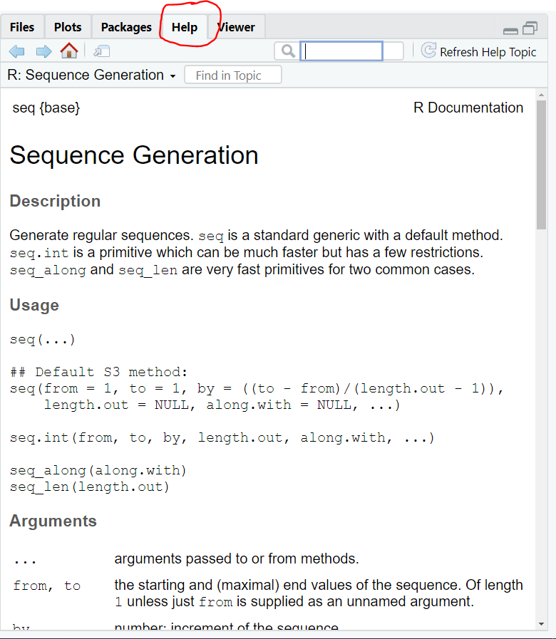
```
]

---

class: inverse, middle, left

# Your Turn

### 1. Open "module01_Rscript.R"
### 2. Highlight Run Code for EXERCISE 02
### 3. Write Code to make plot for tangent of x
### 4. Write Code to make plot of log of x with log y

.center[ZOOM BREAKOUT, 5 MIN]

---

class: inverse, middle, center

# BREAK TILL 10:30 AM