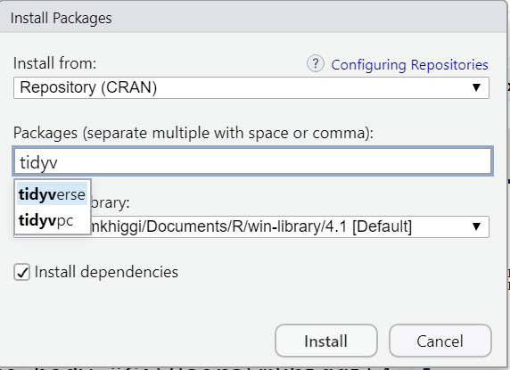

```{r setup, include=FALSE}
# For htmltools package, you may set options(htmltools.dir.version = FALSE) to suppress the version number in the subdirectory name.
options(htmltools.dir.version = FALSE)
knitr::opts_chunk$set(echo = TRUE)
knitr::opts_chunk$set(message = FALSE)
knitr::opts_chunk$set(warning = FALSE)
options(knitr.duplicate.label = "allow")

knitr::opts_chunk$set(fig.width = 6, message = FALSE, warning = FALSE, comment = "", cache = F)

library(emo)
library(fontawesome)
library(knitr)
library(dplyr)
library(flair)
library(flipbookr)
library(tidyverse)

library(xaringanExtra)
xaringanExtra::use_panelset()
xaringanExtra::use_tile_view()
```

# Why Learn R?

* https://www.tiobe.com/tiobe-index/r/
* https://www.tiobe.com/tiobe-index/
* https://r4stats.com/articles/popularity/

---

# R vs Other Stats Software

.pull-left[
## R

* bare bones
* take up little memory
* powerful base packages
* FREE/Open Source
]

.pull-right[
## SPSS, SAS examples

* Have to buy base
* Almost always have to buy add-ons, gets expensive $$
* Have to know what you want ahead of time
* Sometimes end up with more than you need
]

---

# My SAS License Includes:

```{r out.width ='70%', echo=FALSE}

```

---

# My SPSS License Includes:

```{r out.width ='50%', echo=FALSE}

```

---

# R - Base R Packages

.pull-left[

```{r eval=FALSE}
sessionInfo()
```
]


.pull-right[
```{r out.width ='100%', echo=FALSE}

```
]


---

# To add functionality to R - install/load Packages

### FIRST - INSTALL Package(s)

.pull-left[
```{r out.width ='60%', echo=FALSE}

```
]

.pull-right[
```{r out.width ='90%', echo=FALSE}

```
]

---

# List of Packages on Your Machine

.pull-left[
```{r out.width ='100%', echo=FALSE}

```
]

.pull-right[
```{r out.width ='100%', echo=FALSE}

```
]

---
### SECOND - LOAD Package(s) into Current R Session

.pull-left[

```{r sessioninfo1, eval=FALSE}
# load tidyverse
library(tidyverse)

# run sessionInfo() again
# now how many packages are "attached"
# under "other attached packages"
sessionInfo()
```
]

.pull-right[

```{r out.width ='100%', echo=FALSE}

```
]

---

# Where to get R Packages - CRAN

```{r out.width ='100%', echo=FALSE}
knitr::include_url("https://cran.r-project.org/")
```
.footnote[[https://cran.r-project.org/](https://cran.r-project.org/)]
---

# Where to get R Packages - Bioconductor

```{r out.width ='100%', echo=FALSE}
knitr::include_url("https://www.bioconductor.org/")
```
.footnote[[https://www.bioconductor.org/](https://www.bioconductor.org/)]

---

# Where to get R Packages - Github, Local, Others...
[https://github.com/search?l=R&q=packages&type=Repositories](https://github.com/search?l=R&q=packages&type=Repositories)

```{r out.width ='100%', echo=FALSE}
knitr::include_graphics("GithubRPackages.png")
```

---

# Do Your Research

* Always research your packages - like any other "tool"
    * has it be validated? 
    * has it been published? 
    * has is it been used/accepted in your research field or application?
    
--

* Check download stats: [https://hadley.shinyapps.io/cran-downloads/](https://hadley.shinyapps.io/cran-downloads/)

--

* Check CRAN: e.g. `tidyverse` [https://cran.r-project.org/web/packages/tidyverse/index.html](https://cran.r-project.org/web/packages/tidyverse/index.html):
    * check date last updated
    * how many versions
    * how long has it existed

--

* Check Github repo if exists, check issues:
    * `tidyverse` [https://github.com/tidyverse/tidyverse](https://github.com/tidyverse/tidyverse)

---
class: inverse, middle, left

# Your Turn [ZOOM BREAKOUT, 10 MIN]

### 1. Open "module02_Rscript.R"
### 2. Read instructions for EXERCISE 01

* Go to https://hadley.shinyapps.io/cran-downloads/
* How many downloads have there been (on average) recently:
    * for the `ggplot2` and `palmerpenguins` packages?
    * remove `ggplot2` and make plot again
    * compare downloads for `arsenal` and `gtsummary` packages
    
* Go to https://cran.r-project.org/ - click on packages:
    * how many Packages are on CRAN today?
    * list by name and find `ggplot2` package
    * when was it last updated?
    * go to github repo for ggplot2 - any open issues?
    
---

# Interactive RStudio

### 1. Open RStudio
### 2. Open "module02_Rscript.R"
### 3. Go to "DATASETS"

