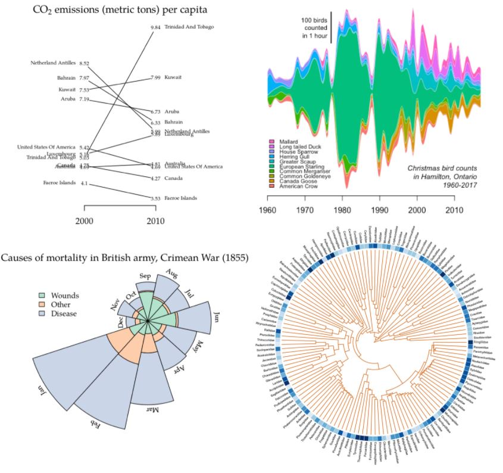
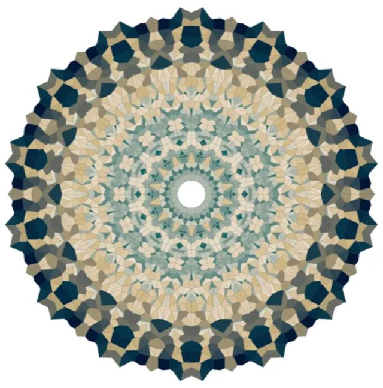
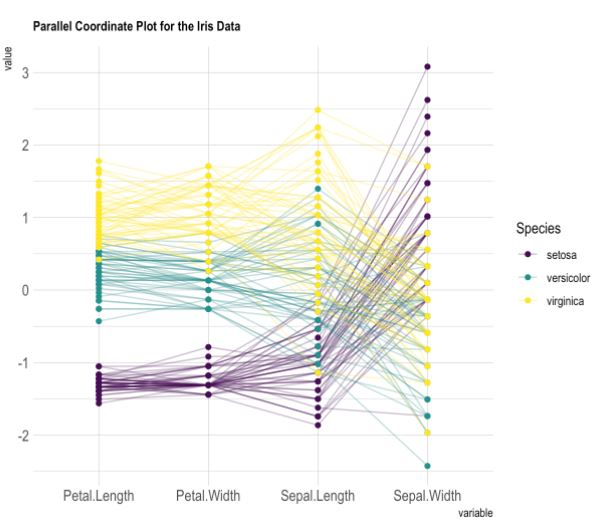
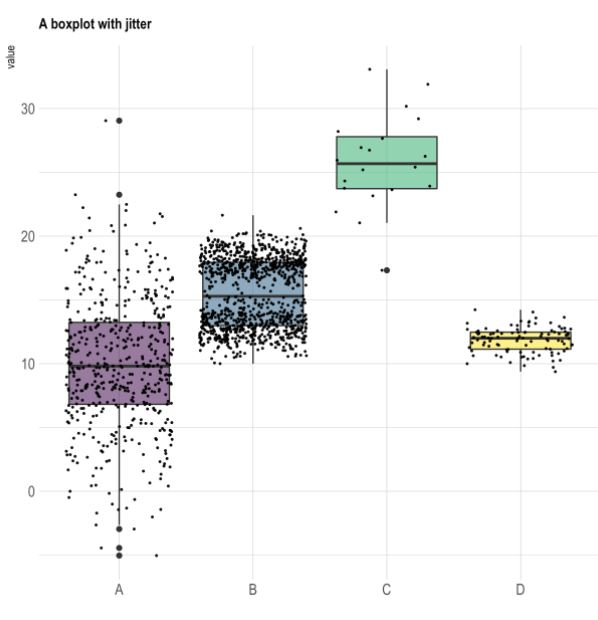
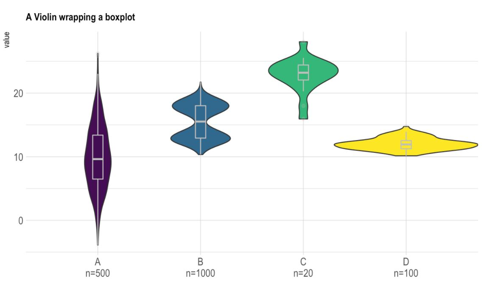
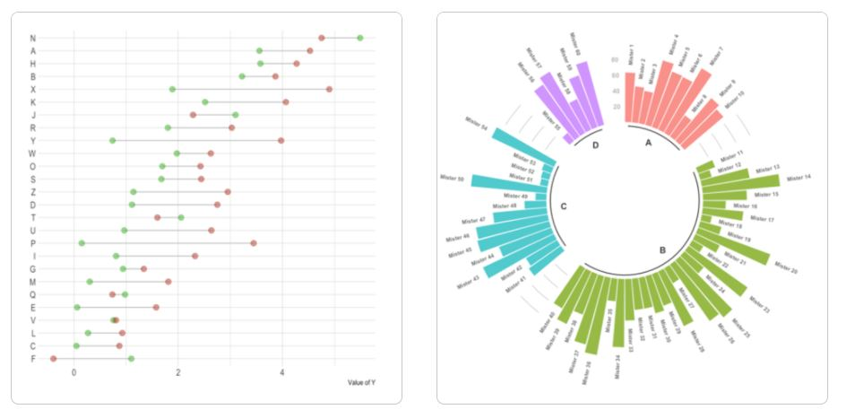

```{r setup, include=FALSE}
# For htmltools package, you may set options(htmltools.dir.version = FALSE) to suppress the version number in the subdirectory name.
options(htmltools.dir.version = FALSE)
knitr::opts_chunk$set(echo = TRUE)
knitr::opts_chunk$set(message = FALSE)
knitr::opts_chunk$set(warning = FALSE)
options(knitr.duplicate.label = "allow")

knitr::opts_chunk$set(fig.width = 6, message = FALSE, warning = FALSE, comment = "", cache = F)

library(emo)
library(fontawesome)
library(knitr)
library(dplyr)
library(flair)
library(flipbookr)
library(tidyverse)

library(xaringanExtra)
xaringanExtra::use_panelset()
xaringanExtra::use_tile_view()
```

background-size: 80%
background-image: url(img/ggplot2_masterpiece.png)
background-position: 70% 70%
class: center, top

.footnote[
* Illustrations by Allison Horst, RStudio Artist in Residence, <https://github.com/allisonhorst/stats-illustrations>
]


---

class: center, middle, inverse

# Be an Artist! 
# Create Awesome Figures with `ggplot2`

---

.left-column[
# ggfree package
]

.right-column[

```{r out.width = '80%', echo=FALSE}

```

]

.footnote[[https://github.com/ArtPoon/ggfree](https://github.com/ArtPoon/ggfree)]


---

.left-column[
# Make Art - Mandalas!
]

.right-column[

```{r out.width = '75%', echo=FALSE}

```

]

.footnote[[https://www.r-craft.org/r-news/mandalas-colored/](https://www.r-craft.org/r-news/mandalas-colored/)]

---

.pull-left[
```{r message=FALSE, warning=FALSE, error=FALSE}
library(kandinsky)
kandinsky(iris)
```
]

--

.pull-right[
```{r}
kandinsky(airquality)
```

]

.footnote[[Link to Kandinsky Package from Github](http://giorasimchoni.com/2017/07/30/2017-07-30-data-paintings-the-kandinsky-package/)]
---

# Get inspired at R-Graph-Gallery

.pull-left[

```{r out.width = '100%', echo=FALSE}

```
]

.pull-right[

```{r out.width = '100%', echo=FALSE}

```

]

.footnote[[https://www.r-graph-gallery.com/ggplot2-package.html](https://www.r-graph-gallery.com/ggplot2-package.html)]
---

# R-Graph-Gallery

```{r out.width = '80%', echo=FALSE}

```

.footnote[[https://www.r-graph-gallery.com/ggplot2-package.html](https://www.r-graph-gallery.com/ggplot2-package.html)]
---
# R-Graph-Gallery - lollipops and roses

```{r out.width = '100%', echo=FALSE}

```

.footnote[[https://www.r-graph-gallery.com/ggplot2-package.html](https://www.r-graph-gallery.com/ggplot2-package.html)]
---

.left-code[

# Make a Scatterplot 

Let's look at the Palmer Penguins dataset. Make a scatterplot of

```{r plot-label, eval=FALSE}
library(palmerpenguins)

# Make a scatterplot
ggplot(penguins) + 
  aes(x=bill_length_mm, 
      y=bill_depth_mm, 
      color = species) + 
  geom_point() +
  xlab("Bill Length (mm)") +
  ylab("Bill Depth (mm)") +
  ggtitle("Penguins Bill Dimensions")
  
```

_See "module03_Rscript.R")_

]

.right-plot[
```{r plot-label-out, ref.label="plot-label", echo=FALSE, out.width="80%"}
```
]

---

.left-code[

# Scatterplot - make plot area

```{r plot-label1, eval=FALSE}
# Step 1 specify dataset 
# penguins for ggplot()
ggplot(penguins) #<<
```

The basic plot space is created.

]

.right-plot[
```{r plot-label1-out, ref.label="plot-label1", echo=FALSE, out.width="80%"}
```
]

---

.left-code[

# Scatterplot - add aethetics

```{r plot-label2, eval=FALSE}
# Next add aes (aesthetics)
ggplot(penguins) + 
  aes(x=bill_length_mm, #<<
      y=bill_depth_mm)  #<<
```

Add "aesthetics" using aes - provide the variables for X and Y axes. Notice the `aes()` is added using the `+` operator.

]

.right-plot[
```{r plot-label2-out, ref.label="plot-label2", echo=FALSE, out.width="80%"}
```
]

---

.left-code[

# Add a `geom_xxx` - Geometric Object

```{r plot-label3, eval=FALSE}
# Add points to graph
ggplot(penguins) + 
  aes(x=bill_length_mm, 
      y=bill_depth_mm) + 
  geom_point() #<<
  
```

Add `geom_point()` to add the **points** to the graph.

]

.right-plot[
```{r plot-label3-out, ref.label="plot-label3", echo=FALSE, out.width="80%"}
```
]

---

.left-code[

# Add Color - use `aes()`

```{r plot-label4, eval=FALSE}
# Add color aesthetic
ggplot(penguins) + 
  aes(x=bill_length_mm, 
      y=bill_depth_mm,
      color = species) + #<<
  geom_point() 
  
```

Add `color` option to the aesthetics inside the `aes()`.

]

.right-plot[
```{r plot-label4-out, ref.label="plot-label4", echo=FALSE, out.width="80%"}
```
]

---

.left-code[

# Add Labels - to the axes and add a title

```{r plot-label5, eval=FALSE}
# Add axis labels and a title
ggplot(penguins) + 
  aes(x=bill_length_mm, 
      y=bill_depth_mm,
      color = species) + 
  geom_point() +
  xlab("Bill Length(mm)") +   #<<
  ylab("Bill Depth (mm)") +    #<<
  ggtitle("Penguins Bill Dimensions")  #<<
  
```

Add axis labels with `xlab()` and `ylab()` and add a title with `ggtitle()`.

]

.right-plot[
```{r plot-label5-out, ref.label="plot-label5", echo=FALSE, out.width="80%"}
```
]


---

.footnote[See more themes at [https://ggplot2.tidyverse.org/reference/ggtheme.html](https://ggplot2.tidyverse.org/reference/ggtheme.html)]

.left-code[

# Jazz it up - add a theme

```{r plot-label6, eval=FALSE}
# Add axis labels and a title
ggplot(penguins) + 
  aes(x=bill_length_mm, 
      y=bill_depth_mm,
      color = species) + 
  geom_point() +
  xlab("Bill Length(mm)") + 
  ylab("Bill Depth (mm)") + 
  ggtitle("Penguins Bill Dimensions") +
  theme_dark() #<<
  
```

]

.right-plot[
```{r plot-label6-out, ref.label="plot-label6", echo=FALSE, out.width="80%"}
```
]

---

.footnote[Try `ggthemes` on CRAN [https://cran.r-project.org/web/packages/ggthemes/index.html](https://cran.r-project.org/web/packages/ggthemes/index.html)]

.left-code[

### `ggthemes` package

```{r ggtheme1, eval=FALSE}
library(ggthemes)

ggplot(penguins) + 
  aes(x=bill_length_mm, 
      y=bill_depth_mm,
      color = species) + 
  geom_point() +
  xlab("Bill Length(mm)") + 
  ylab("Bill Depth (mm)") + 
  ggtitle("WSJ Theme") +
  theme_wsj()
```
]

.right-plot[
```{r ggtheme1-out, ref.label="ggtheme1", echo=FALSE, out.width="80%"}
```
]

---

.footnote[See `ggthemr` in development on Github [https://github.com/Mikata-Project/ggthemr](https://github.com/Mikata-Project/ggthemr)]

.left-code[

### `ggthemr` package

```{r ggthemr1, eval=FALSE}
library(ggthemr)

ggthemr('pale')
ggplot(penguins,
       aes(x=bill_length_mm, 
           y=bill_depth_mm,
           colour = species)) + 
  geom_point() +
  xlab("Bill Length(mm)") + 
  ylab("Bill Depth (mm)") + 
  ggtitle("ggthemr - pale theme") +
  scale_colour_ggthemr_d()
ggthemr_reset()

```

]

.right-plot[
```{r ggthemr1-out, ref.label="ggthemr1", echo=FALSE, out.width="80%"}
```
]
---

class: center, middle, inverse

# A Great Resource - R Graphics Cookbook

### [https://r-graphics.org/](https://r-graphics.org/)

and

### [http://www.cookbook-r.com/Graphs/](http://www.cookbook-r.com/Graphs/)

---

.footnote[See code examples at [http://www.cookbook-r.com/Graphs/Plotting_distributions_(ggplot2)/](http://www.cookbook-r.com/Graphs/Plotting_distributions_(ggplot2)/)]

.left-code[

# Make a histogram with overlaid density curve

```{r histplot, eval=FALSE}
# Look at flipper_length_mm
# for Palmer Penguins
# Histogram with density curve
# Use y=..density..
# Overlay with transparent density plot
ggplot(penguins, 
       aes(x=flipper_length_mm)) + 
  geom_histogram(aes(y=..density..),      
                 binwidth=2,
                 colour="black", 
                 fill="white") +
  geom_density(alpha=.2, 
               fill="#FF6666") 
```

]

.right-plot[

```{r histplot-out, ref.label="histplot", echo=FALSE, out.width="90%"}
```

]

---
class: left, middle, inverse

# YOUR TURN [ZOOM BREAKOUT 10 MIN]

### 1. Open module03_Rscript.R
### 2. Do EXERCISE 02
### 3. Do EXERCISE 03

---

# Break out by Facet/Panels

.left-code[

```{r histplot2, eval=FALSE}
# Look at flipper_length_mm
# for Palmer Penguins
# Histogram with density curve
# Use y=..density..
# Overlay with transparent density plot
ggplot(penguins, 
       aes(x=flipper_length_mm)) + 
  geom_histogram(aes(y=..density..),      
                 binwidth=2,
                 colour="black", 
                 fill="white") +
  geom_density(alpha=.2, 
               fill="#FF6666") +
  facet_wrap(vars(species)) #<<
```

Add `facet_wrap()` to make histogram plots for each penguin species in a different facet or panel.

]

.right-plot[

```{r histplot2-out, ref.label="histplot2", echo=FALSE, fig.dim=c(5, 3), out.width="100%"}
```

]

---

# Add best fit line to scatterplot

.left-code[

```{r scatter01, eval=FALSE}
# take out color=species
ggplot(penguins,
       aes(x=bill_length_mm, 
           y=bill_depth_mm)) + #<<
  geom_point() +
  # add best fit line
  # using lm, linear model
  geom_smooth(method=lm) + 
  xlab("Bill Length(mm)") + 
  ylab("Bill Depth (mm)") + 
  ggtitle("Penguins Bill Depth by Length")
```
]

.right-plot[

```{r scatter01-out, ref.label="scatter01", echo=FALSE, fig.dim=c(5, 3), out.width="100%"}
```

]

---
# Add `color` back, see how fit lines change

.left-code[

```{r scatter02, eval=FALSE}
ggplot(penguins,
       aes(x=bill_length_mm, 
           y=bill_depth_mm,
           color = species)) + #<< 
  geom_point() +
  geom_smooth(method=lm) + 
  # add best fit line
  # using lm, linear model
  xlab("Bill Length(mm)") + 
  ylab("Bill Depth (mm)") + 
  ggtitle("Penguins Bill Depth by Length")
```
]

.right-plot[

```{r scatter02-out, ref.label="scatter02", echo=FALSE, fig.dim=c(5, 3), out.width="100%"}
```

]

---
class: left, middle, inverse

# YOUR TURN [ZOOM BREAKOUT 5-10 MIN]

### 1. Open module03_Rscript.R
### 2. Do EXERCISE 04
### 3. Do EXERCISE 05

---

# Make side-by-side boxplots

.left-code[

```{r boxplot01, eval=FALSE}
# Do boxplots of body_mass_g
# by year as a factor
ggplot(penguins, 
       aes(x=as.factor(year), 
           y=body_mass_g)) + 
  geom_boxplot() + 
  xlab("Year") +   
  ylab("Body Mass (g)") + 
  ggtitle("Body Mass by Year")
```
]

.right-plot[

```{r boxplot01-out, ref.label="boxplot01", echo=FALSE, fig.dim=c(5, 3), out.width="100%"}
```

]

---

# Add points over boxplots with jitter

.footnote[Get Ideas at R-Gallery [https://r-graph-gallery.com/89-box-and-scatter-plot-with-ggplot2.html](https://r-graph-gallery.com/89-box-and-scatter-plot-with-ggplot2.html)]

.left-code[

```{r boxplot02, eval=FALSE}
# Do boxplots of body_mass_g
# by year as a factor
# add jitter'ed points
ggplot(penguins, 
       aes(x=as.factor(year), 
           y=body_mass_g)) + 
  geom_boxplot() + 
  geom_jitter(color="black") +
  xlab("Year") +   
  ylab("Body Mass (g)") + 
  ggtitle("Body Mass by Year")
```
]

.right-plot[

```{r boxplot02-out, ref.label="boxplot02", echo=FALSE, fig.dim=c(5, 3), out.width="100%"}
```

]
---

class: left, middle, inverse

# YOUR TURN [ZOOM BREAKOUT 5-10 MIN]

### 1. Open module03_Rscript.R
### 2. Do EXERCISE 06
### 3. Do EXERCISE 07

---

class: center, middle, inverse

# Pulling it together - make a canvas

# Patchwork!

```{r out.width = '20%', echo=FALSE}
knitr::include_graphics("img/patchworklogo.png")
```

---

```{r out.width = '80%', echo=FALSE}
knitr::include_graphics("img/patchwork_blank.png")
```

---

.left-code[

```{r plot-patch, eval=FALSE}
library(ggplot2)
library(patchwork)

# save each plot as an object
p1 <- ggplot(penguins, 
         aes(x=bill_length_mm, 
             y=bill_depth_mm, 
             color = species)) +
  geom_point()  
  
p2 <- ggplot(penguins, 
             aes(x=species, 
                 y=bill_length_mm)) + 
  geom_boxplot() + 
  xlab("Species") +   
  ylab("Bill Depth (mm)")

p3 <- 
  ggplot(penguins, 
         aes(x=flipper_length_mm)) + 
  geom_histogram(aes(y=..density..),      
    binwidth=2, colour="black", 
    fill="white") +
  geom_density(alpha=.2, fill="#FF6666") +
  facet_wrap(vars(species))
  
# arrange plots as you like
(p1 | p2) / p3
```

]

.right-plot[

```{r plot-patch-out, ref.label="plot-patch", echo=FALSE, fig.dim=c(8, 8)}
```

]

---

class: left, middle, inverse

# YOUR TURN [ZOOM BREAKOUT 5 MIN]

### 1. Open module03_Rscript.R
### 2. Do EXERCISE 08


